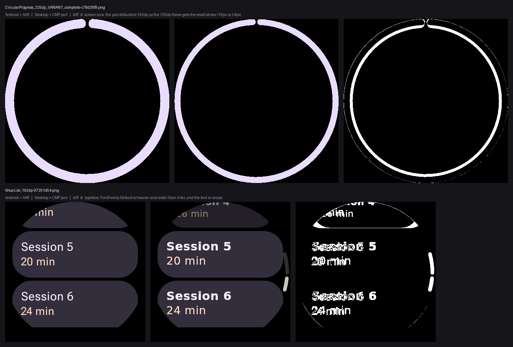

# The Compose Multiplatform port of Wear Compose

`:catalog` renders on Robolectric against `androidx.wear.compose:compose-material3`, the real
Android AAR. `:catalog-cmp` compiles **the same sources** against a Compose Multiplatform port of
that library and renders them on the desktop renderer. This file is why that is possible, what it
costs, and what it is for.

## What the port is

`ee.schimke.wearcmp` — published from the [`wear-compose-cmp-maven`][branch] branch of this
repository, laid out as a Maven repository so there is nothing to host.

| | |
| --- | --- |
| Artifacts | `wear-compose-material3`, `wear-compose-foundation`, `wear-compose-material-core`, `port-runtime` |
| Version | `1.7.0-beta02-cmp01` — the AAR version it was generated from, plus a port revision |
| Targets | `jvm`, `wasm-js`. **No `android` variant**, by design: Android has the AAR |
| Built against | Compose Multiplatform 1.12.0, Kotlin 2.4.10 |
| Provenance | `// Generated from AndroidX Wear Compose by tools/transform.py — DO NOT EDIT.` |

It is a **source transform of the AndroidX sources**, not a reimplementation, and it keeps the
original package names: its classes land in `androidx.wear.compose.material3`, `…foundation` and
`…materialcore`. `port-runtime` supplies the host seams the Android platform used to
(`LocalTime`, rotary haptics, `WearDeviceConfiguration`, screen-always-on, accessibility) under
`ee.schimke.wearcmp.port`, which nothing in this repository names directly.

That is the whole trick, and it is why `:catalog-cmp` needs no `expect`/`actual` and no edited
import: **the library is chosen by the module, not by the code.**

[branch]: https://github.com/yschimke/wear-m3-catalog/tree/wear-compose-cmp-maven

## Why it can be trusted to stand in for the AAR

Because it was measured, not assumed. Comparing the port's JVM jar against
`androidx.wear.compose:compose-material3:1.7.0-beta02` (the version `libs.versions.toml` pins for
`:catalog`), at the level of JVM signatures:

| | AAR | Port |
| --- | --- | --- |
| Public classes in `androidx.wear.compose.material3` | 239 | 211 |
| Public facade functions | 380 | 354 |
| **Shared signatures that DIFFER** | — | **0** |
| Only in the port | — | 1 (`DefaultTimeSourceKt`, its own time source) |

Zero divergence on every symbol both carry, mangling included — `Text--4IGK_g` is `Text--4IGK_g`
on both sides. Nothing was reshaped; things were **omitted**, and the omissions are listed below.

Reproduce it by extracting `classes.jar` from the AAR and the port's `-jvm` jar and diffing
`javap -p` over `androidx/wear/compose/material3/*Kt.class`, normalising the inline-class name
mangling (`-P1_1MVs` and friends) away.

## `:catalog` is the oracle, and this is not a second catalog

Two rules, and they are the point of the arrangement:

1. **`:catalog-cmp` owns no catalog sources.** It `srcDir`s `catalog/src/main/kotlin` and subtracts
   files. A sticker edited in `:catalog` is edited here or it is edited nowhere — a parallel tree of
   copies would answer the same question for about a month and then quietly stop.
2. **The Android lane is authoritative.** This repository reproduces the Design Kit against the real
   library; the port is a stand-in for it. A difference between the two renders is a finding about
   the PORT until proven otherwise, never a reason to change a sticker.

The second rule is what keeps this on the right side of the line the builder's
`UI_BUILDER_WEAR_SCREEN.md` draws — *never fabricate a component so it can run somewhere it has no
library*. A transformed upstream source is not a fabrication. It is also not the AAR, so it does not
get to claim the AAR's authority without evidence.

## What does not cross, and why

Eight files are excluded in `catalog-cmp/build.gradle.kts`. Whole files, each for a stated reason —
a file is never excluded because a sticker was inconvenient.

### Horologist — Android AARs with no port (5 files, 17 components)

`HorologistSamples.kt`, `sections/Auth.kt`, `sections/FastScrolling.kt`,
`sections/MediaControls.kt`, `sections/Motion.kt`. The `*-material3` artifacts are Android
libraries; nothing has ported them. The `Horologist` section simply does not exist on this lane, and
that is honest rather than lossy — those components are still rendered by `:catalog`.

### Surfaces the port omits (2 files, 9 components)

`sections/Pickers.kt` and `sections/Dialogs.kt`, plus `AnimatedText` in `sections/TextComponents.kt`
and `sections/Motion.kt`. The port drops exactly the classes bound to `java.time`, `Calendar`,
Android resources and a `BroadcastReceiver`:

`DatePicker*`, `TimePicker*`, `ConfirmationDialog*`, `OpenOnPhoneDialog*`, `AnimatedText*`,
`ResourceHelper`, `TimeBroadcastReceiver`.

Plain `Picker` and `PickerGroup` **are** ported — it is the composed pickers that are not. `java.time`
exists on the JVM, so a jvm-target actual for `DatePicker` / `TimePicker` is a real possibility for
the port; wasm is the hard one.

### One-handed gestures — half-ported (1 file, 4 components)

`sections/OneHandedGestures.kt`. The port carries `OneHandedGestureManager` and its configuration
but not the indicators or the modifier the stickers call: `OneHandedGestureClickIndicator`,
`…ScrollIndicator`, the two page indicators and `Modifier.oneHandedGesture` are absent, along with
the `GestureRegistry` and `GestureAccessibilityAnnouncer` behind them.

### Downloadable fonts — replaced, not excluded

`CatalogFonts.kt` resolves Roboto Flex, Inter, JetBrains Mono and Google Sans Flex through
`androidx.compose.ui.text.googlefonts`, an Android `FontsContract` provider. There is no such thing
off Android. `catalog-cmp/src/jvmMain/.../CatalogFontsCmp.kt` substitutes it role-for-role with
`FontFamily.Default`, so **theme and typography stickers on this lane draw the wrong typefaces on
purpose** and a cross-lane diff of those says nothing about the port. Closing it means vendoring the
four families as Compose resources, which carries a licensing question (three are OFL; Google Sans
Flex is not).

### The whole-file cost

Excluding a file for one missing symbol is blunt: `TextComponents.kt` loses 7 components for
`AnimatedText` alone, and `Motion.kt` loses 3 for the same. Splitting those files so the affected
stickers sit on their own is the obvious follow-up, and worth doing before anyone reads a coverage
number off this lane.

**Net: 24 of 32 files, and 47 of 84 components, compile against the port today.**

## Why `jvm()` and not `wasmJs()`

The port publishes a wasmJs klib and the ui-builder canvas is the eventual prize — but two
compose-ai-tools artifacts this catalog is built from are JVM-only:

- `ee.schimke.composeai:preview-annotations` is KMP but publishes a `jvm` target only
  (`metadataApiElements`, `jvmApiElements-published`, `jvmSourcesElements-published`).
- `ee.schimke.composeai:data-preview-overrides-runtime` has no Gradle module metadata at all.

So a wasm compilation would have no `@CatalogComponent` and no knob surface — the two things the
whole inventory is built from. That is an upstream gap to close in compose-ai-tools, not something
this module can route around.

## Why `:catalog` itself is not the multiplatform module

The obvious shape is one module with three targets, and it is currently impossible. On AGP 9.4:

```
The 'org.jetbrains.kotlin.multiplatform' plugin with `androidTarget()` enabled is not compatible
with AGP's 9.0 new DSL (`android.newDsl=true` is enabled by default).
```

AGP's own remedy is `android.newDsl=false`, and that does not work either: with the old DSL the
`android { }` accessor resolves to the deprecated `BaseAppModuleExtension` overload, which the
Kotlin DSL reports as a **script compilation error**, not a warning. (`android.builtInKotlin=false`
is also needed to get that far, because AGP 9 registers its own `kotlin` extension.)

The blessed route, `com.android.kotlin.multiplatform.library`, loses the Robolectric lane:
compose-ai-tools routes that plugin to the **desktop** renderer deliberately
([#248](https://github.com/yschimke/compose-ai-tools/issues/248), closed by
[#254](https://github.com/yschimke/compose-ai-tools/pull/254)), and a Wear AAR cannot draw on
`ImageComposeScene`. For a catalog whose entire value is real Wear Compose on Robolectric, that
trade is not available.

So: two modules over one source tree, until the plugin can give KMP-Android the Robolectric lane.
Then `:catalog` absorbs this module's source sets and `:catalog-cmp` goes away.

## Keeping the two honest

- **The versions move together.** `wear-compose` and `wearcmp` in `libs.versions.toml` describe the
  same library; a `:catalog` on `1.7.0-beta03` beside a port generated from `-beta02` would report
  library skew as a port defect, or hide a real one. Bump both in one commit or neither.
- **The repository is pinned to a commit, not the branch.** `wear-compose-cmp-maven` is mutable and
  `1.7.0-beta02-cmp01` is not; tracking the branch name would let the bytes behind a fixed version
  string change under a green build. Repoint it deliberately, the way `remote-snapshot-pin` is.
- **The repository is group-fenced** to `ee.schimke.wearcmp` in `settings.gradle.kts`, so `:catalog`
  cannot resolve a Wear class from anywhere but Google Maven no matter what anyone adds later.

## What the first A/B run found

Both lanes rendered, and `scripts/cmp-ab.py` compared every sticker they share. **899 shared
stickers; not one confirmed port defect.** Every difference traced so far is this repository's
wiring of the port, or the renderer's configuration — which is exactly what a first run should find,
and exactly why the gate exists.

| | count |
| --- | --- |
| Shared stickers | 899 |
| Not comparable — frame size differs | 529 |
| Clean (< 0.01% of pixels past a 16/255 tolerance) | 55 |
| Differ | 315 |

### 1. The device-less previews are not comparable yet (529 stickers)

Every size mismatch is the same ratio, 1.3125, and the manifests say why: the Android lane renders
those previews at `density: 2.0`, the CMP lane at `2.625`. That is Studio's xxhdpi phone default
against the Wear one.

The plugin already handles this — `PreviewDiscovery` retargets a Wear module's device-less
wrap-content previews to 227dp @ 2.0x — but it decides whether a module is Wear by looking for
`android.hardware.type.watch` in the **merged Android manifest** (`DiscoverPreviewsTask`). A Compose
Multiplatform module has no manifest, so `isWear` is false and the retarget never runs. The
extension can turn the retarget OFF (`composePreview.retargetWearPreviews`) but cannot declare a
non-Android module to be Wear.

**Upstream ask:** an explicit `composePreview { wear.set(true) }` feeding `Input.isWear`, so a
module can say what a manifest would have said. Until then these 529 stickers are out of the gate.
The device-pinned previews — the `_192dp` … `_240dp` full-screen fan-out, which name their own
`spec:` at density 2.0 — line up exactly, which is what makes the other 370 comparable at all.

### 2. The port does not know what screen it is on (the geometry diffs)

`CircularProgressIndicator` draws a **24px stroke on Android and 16px on the port**, in the same
450×450 frame. Not antialiasing — a different branch.

`port-runtime` replaces Android's `Configuration` with `WearDeviceConfiguration`, whose
`screenWidthDp` defaults to `DEFAULT_SCREEN_DP = 192`. Nothing in `:catalog-cmp` provides one, so
every sticker believes it is on a 192dp watch however large the frame it is being drawn into, and
Wear's size-dependent defaults pick the small-screen branch. The port's own KDoc names the fix:

```kotlin
LocalWearDeviceConfiguration provides WearDeviceConfiguration(screenWidthDp = 227)
```

This is **our wiring, not a port defect**: the CMP lane's sticker frames have to provide the
configuration their `@Preview` device declares, the way Android's `Configuration` does for free.
It accounts for the `CircularProgress`, `ValueStepper` and `Indicator` families in the difference
list, and should be the first thing fixed — it is the one cause that changes real geometry.

### 3. Text differs everywhere, by construction

`SwipeToRevealCard` (16.9%) and `WearList` (15.5%) top the list and neither is a drawing bug:
[the substituted typefaces](#downloadable-fonts--replaced-not-excluded) are heavier and wider than
Inter, so glyphs differ and the text **re-wraps**, which moves the card that contains it. Any
sticker carrying text will differ on this lane until the four families are vendored as Compose
resources.

So the honest reading of the 315: subtract the text-bearing ones and the screen-size ones and there
is nothing left that has been shown to be the port's fault. That is a good first result, and it is
not the same as the port being proven — it means the gate is now the thing that can prove it.



## What comes next

1. **Provide `LocalWearDeviceConfiguration` on the CMP lane**, from the frame each preview declares.
   The one cause above that moves real geometry, and the cheapest to fix.
2. **Vendor the four typefaces** as Compose Multiplatform resources, which is what makes every
   text-bearing sticker comparable. Licensing: three are OFL, Google Sans Flex is not.
3. **Ask compose-ai-tools for an explicit Wear flag** on the extension, which brings the other 529
   stickers into the gate.
4. **Then wire `scripts/cmp-ab.py --fail-over` into CI**, once the three above have taken the known
   causes out of the numbers. Running it as a gate before that would just pin the noise.
5. Split `TextComponents.kt` and `Motion.kt` so one missing symbol stops costing ten components.
6. Publish wasm targets for `preview-annotations` and the overrides runtime upstream; then add
   `wasmJs()` here, which is what the ui-builder canvas needs.
7. Fill the port's gaps — the composed pickers and the gesture indicators first, since both have a
   plausible JVM implementation.
