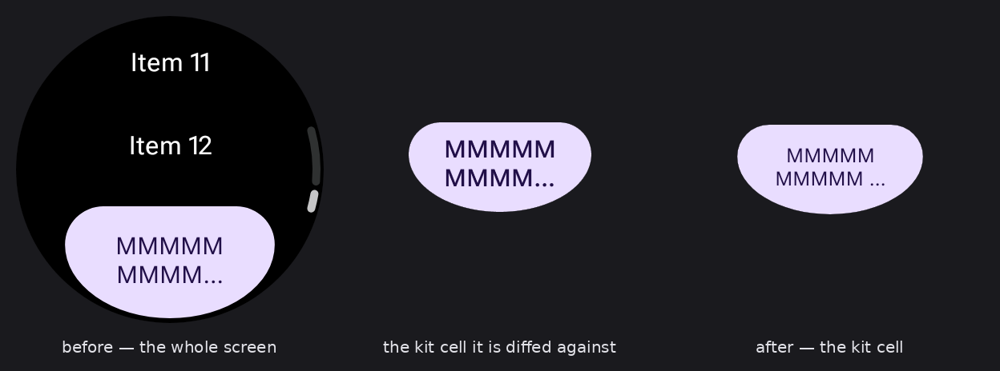
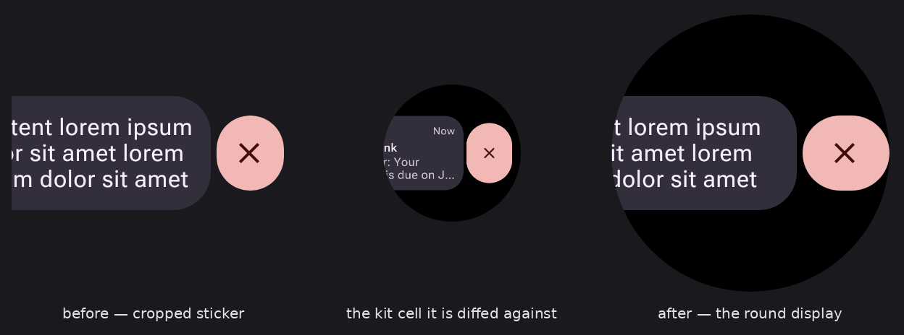
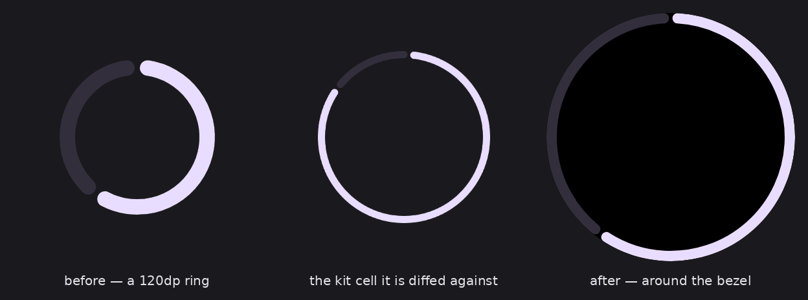

# design-map.json, and what a reference has to name

`design-map.json` is the correspondence file design-parity reads to know which kit node a rendered
component is meant to look like. It is not hand-written:
[`scripts/design-map.sh`](../scripts/design-map.sh) projects it out of the discovered preview
manifest, in two steps that live in two upstream packages because the question splits there.

1. **`@yschimke/compose-design-map`** knows what the ANNOTATIONS mean. It joins each component's
   `@CatalogComponent(reference = …)` to one of its rendered captures and emits the base map, plus a
   sidecar (`design-map-variants.json`) declaring which other previews are the same component with
   knobs turned.
2. **`@design-parity/kit-index`** knows what the KIT means. `shape=square` is a fact about a Compose
   API and `Shape=Square` is a fact about the Wear kit; it resolves those declarations against the
   committed [`figma-kit-index.json`](../figma-kit-index.json) into tagged ref/previewId pairs.

Both are pinned to an exact version, because both outputs are committed and CI fails on any
difference.

## A reference names one VARIANT, never the set

This is the rule the whole file hangs on, and it is easy to get wrong in the direction that still
looks like it works. The kit publishes a component as a `COMPONENT_SET`: a grid whose cells are the
axis vectors — the `Button` set is 50 cells over `Style / Icon / Icon size / Alignment / Disabled`.
A `reference` must name **one of those cells**:

```kotlin
@CatalogComponent(
  id = "Button/Filled",
  // Style=Filled, Icon=No, Icon size=n/a, Alignment=Center, Disabled=No — the cell this sticker
  // actually draws.
  reference = "figma:B24oss2tTeXAFykyeyusz0/35239:93092",
  // The set it is a cell of. Not the thing parity diffs; the handle a whole-screen import matches
  // an instance through, and the join key `kit-sets.json` and CatalogKitCoverageTest use.
  referenceSet = "figma:B24oss2tTeXAFykyeyusz0/35239:93088",
)
```

Three things break when the reference names the set instead, and none announce themselves:

- **Parity diffs a sticker against a grid.** The set frame's geometry is an editor artifact — a
  1068×928 board of 50 buttons. Comparing one 52dp button against it reports the whole board as a
  difference, which is a finding nobody can act on.
- **No variant cell can resolve.** `@OverrideVariant(kitAxis = "Disabled", kitValue = "Yes")` means
  "the sibling of my reference with `Disabled=Yes`" — the resolver varies ONE axis from a known
  vector. A set has no vector to vary from, so every cell resolves to nothing, silently.
- **The imported kit pages barely link.** The node → code join is by node id, so a set-level map
  links only the 33 set frames out of 1845 walked nodes. At variant granularity the same map links
  181, each a cell a reader can click through to the render that reproduces it.

`CatalogInventoryTest` checks that a reference exists and names this kit's file key.
`CatalogKitCoverageTest` joins on `referenceSet`, because [`kit-sets.json`](../kit-sets.json) has
one row per published set.

## …and the variant has to be the same SHAPE of artwork

Naming a cell is necessary and not sufficient. A comparison only means something when the render and
the reference are pictures of the same kind of thing, and sizes are how you tell the kinds apart:

| kit cell | size | what it is | what compares to it |
| --- | --- | --- | --- |
| component | `172×52`, `192×59`, … | the component alone, cropped to itself | a `Sticker` — wraps and is cropped |
| display | `192×192` (and `225×225`) | the round watch face, whole | a `FullScreenSticker` on a round device |
| long scroll | `192×354` … `192×500` | a scrolling screen unrolled past the bottom of any watch | **nothing this catalog publishes** |

The third is a trap, because it is a perfectly good reference that no device-framed render can be
diffed against: the comparison squashes the reference to the render's aspect first, so every element
arrives too short and the whole frame reads as a difference. The finding is real and useless — it
says "these are different shapes", which is true of the mapping rather than of the component.

**When a set publishes both, take the display cell.** `Dialog` does, behind `Scrolling=`; the
`Scrolling=No` cells are the same arrangements drawn on a 192×192 display. Because a cell resolves
by varying one axis from the base, moving the base moves its cells with it. A long-scroll reference
would need a preview that captures its own full scroll extent, which is a renderer capability rather
than a mapping choice.

### The rule cuts both ways, and the frame is the half that moves

The reference is chosen by which cell the component *is*; what then has to follow is the **frame the
render is published in**, because the reference is fitted to the render's frame before it is diffed.
Naming the right cell and rendering it in the wrong frame lands exactly where naming the wrong cell
does. It goes wrong both ways:

- **A component cell rendered as a screen.** `EdgeButton`'s cells are `192×49/59/73/99` — the button
  alone — so publishing a whole round watch face with a list, a time text and a scroll indicator
  reports everything on that screen except the button as a difference from a button. It renders
  through `EdgeButtonSticker`: the 192dp screen width to clip the arc against, and nothing else.
  What is left over is 3dp — `EdgeButton` measures 3dp taller than its `EdgeButtonSize` on *each*
  side and the kit's cell keeps only the lower one, so a `Size=Default` capture is `192×62` against
  a `192×59` cell. The screen did not have to be thrown away to get there: the scroll-driven reveal
  is a recording in `Motion.kt`, the honest home for something one frame cannot show.
- **Display cells rendered as cropped stickers.** `SwipeToReveal/Card` and `SwipeToReveal/Button`
  both draw `192×192` displays with the item slid far enough left that the watch's own edge clips
  it. Both render through `FullScreenSticker` at every screen size, like every other display cell.
- **And one where the family resemblance hides it.** `CircularProgressIndicator`'s cell is a
  `192×192` display with the ring 2dp inside the bezel. Its two siblings are genuinely component
  cells — `Progress-Indicator-Small` is `80×80`, `Progress-Indicator-Linear` is `172×12` — so three
  sets do not share a frame just because they share an API family.

Each row below is the published render, the kit cell parity was fitting to it, and the render after.
Everything is at 2px/dp except the middle panel, which is the reference **as parity produced it**,
fitted to the old frame.







**A component cell can be off by a size, too.** `EdgeButton`'s kit cells are `EdgeButtonSize` plus
the 3dp floor — `49=46+3`, `59=56+3`, `73=70+3`, `99=96+3` — so the kit's `Small` is Compose's
`ExtraSmall`, its `Default` is `Small`, its `Large` is `Medium` and its `Extra-Large` is `Large`.
Reading the two four-item lists off in parallel makes every cell one step too big and invents a gap
at each end. The cells are named for the Compose value and carry the kit's spelling in `kitValue`.

## The words are part of the mapping

A sticker and its reference have to say the same thing. The kit labels its filled button "Primary
label", its title card "Title card title text lorem ipsum dolor sit amet", its alert dialog "Dialog
title one to three lines"; a catalog that says "Filled", "Workout" and "Delete this run?" carries a
difference on every card that is only ever going to be reported as a difference.

`design-led` decides who moves: the kit is authoritative and cannot be written to from here, so the
catalog takes the kit's copy as its **default**, in one place —
[`CatalogCopy.kt`](../catalog/src/main/kotlin/ee/schimke/wearm3catalog/CatalogCopy.kt) — with the
node each string is transcribed from. Two reasons it matters more than it sounds:

- **Copy moves geometry.** A component sticker is cropped to what it draws, so a button reading
  "Filled" is a different outline from one reading "Primary label", and the reference then gets
  squashed into that frame. Matching the words fixes most shape mismatches on its own.
- **It hides the real findings.** A wrong radius or a missing border is invisible in a diff already
  lit up by text, which is exactly the class of defect this repo exists to catch.

**The realistic copy is not gone, it is a knob.** Every string goes through `kitCopy(key, kit)`,
which is `previewOverrideString` with the kit's value as the default: the *baked* capture — the one
design-parity diffs — is always the kit's words, while the preview server's override panel retypes
any of them live. Overrides are not cells, so none of this adds a render, a card, or a row here.

Where a kit cell shows its text truncated (the cards all do) the constant is the full string the kit
is truncating, so the ellipsis lands in the same place.

## What is in the map today

| | |
| --- | --- |
| components mapped | 49 |
| references, base + resolved variant | 185 |
| variant cells resolved onto a kit node | 137 of 209 |
| …of which breakpoint cells, which no kit node answers yet | 56 |
| kit page nodes joined to code | 185 of 1845 |
| components with no reference, for a stated reason | 4 |

## The two kinds of miss, and which one is a bug

The projector reports them apart, and that separation is the point of reading its output at all.

**A stated absence is not a gap.** `ButtonGroup`, `TransformingLazyColumn`, `Scaffold` and
`ArcProgressIndicator` carry `noReference = "<why the kit has none>"` — they enter through the
second door in [`AGENTS.md`](../AGENTS.md), being Wear Compose components the kit never published.
That is what `scripts/design-map.sh` runs `--strict --allow-stated-absence` for: plain `--strict`
gates on every kind of absence including a stated one, and the opt-in narrows it back to what it is
for — still fatal on a missing reference and on captures that pair with none, permissive about one
somebody already looked at and wrote down.

**An unresolved variant cell is usually the kit's matrix, not a mistake.** Of the cells that are not
breakpoints, the ones that do not resolve fall into two shapes:

- *The kit has no such axis.* `LevelIndicator`'s `low` / `full` turn a Compose float; the kit's
  `Level-Indicator-RSB` varies `Size`, not level. `CircularProgressIndicator`'s `indeterminate` has
  no kit counterpart at all. Nothing to name, so these cells carry no `kitAxis`.
- *The kit couples two axes and the cell can only name one.* The `Button` set has `Icon size=n/a`
  exactly when `Icon=No`, so moving `Icon=No → Yes` is inherently a two-axis move and no sibling
  exists one step away. `AlertDialog`'s `Edge Option=None` only ever appears with `Bottom=No`;
  `DatePicker`'s `Year first` only with `Limit=Past only`/`Future only`; `IconToggleButton`'s
  `Selected=Off` only with `Style=Tonal`. `@OverrideVariant` carries one `kitAxis`/`kitValue` pair,
  so these are reported rather than guessed at — pairing the wrong cell would diff a whole palette
  and call it a finding.

## Every screen size the kit recognises

A full-screen sticker publishes one capture per screen size, and the sizes are the **kit's own**,
enumerated in its private `.WatchPuck` set on the Meta Components page:

| kit name | dp | how it is rendered here |
| --- | --- | --- |
| `xSml 192 (Legacy)` | 192 | `id:wearos_small_round` — **the base** |
| `Sml 204` | 204 | `spec:width=204dp,…,dpi=320,isRound=true` |
| `Med 216` | 216 | `spec:width=216dp,…` |
| `Lrg 225 (breakpoint)` | 225 | `spec:width=225dp,…` |
| `xLrg 240` | 240 | `id:wearos_xl_round` |

**`id:wearos_large_round` is deliberately absent.** It is 227dp, a size the kit does not draw — it
sits between `Lrg 225` and `xLrg 240`. Rendering full-screen stickers there puts a scale difference
under every full-screen comparison: a 52dp button is 27% of the kit's frame and 23% of that one, and
no amount of matching content closes it. Wear tooling publishes named device ids for only two of the
kit's five sizes, so the middle three are `spec:` strings at the same 2.0 density.

**192 is the base, and the kit's own table calls it legacy.** That is not a contradiction to resolve
in the catalog's favour: whatever the puck table says, the kit *draws* every one of its screen cells
at 192×192, so the base capture has to be the 192 one or the base comparison is not like-for-like.
The projector picks the narrowest by default, so `scripts/design-map.sh` passes no
`--base-breakpoint`.

The other four **fold under the base as `<dp>dp` cells** rather than becoming four more components —
a size is an argument to the same screen, not a different screen. Only the `Picker` set publishes a
second size in the kit (`Larger Screen (BP)=Yes` at 225), so the rest of the breakpoint cells are
renders with no kit counterpart, reported as such rather than pretended to have matched. Resolving
Picker's 225 cell onto that node needs a way to spell a kit axis on a breakpoint, which no
annotation carries yet.

## What still differs, and which kind of thing it is

With the copy aligned, what is left is structural — which is the point. Recorded here so the next
reader can tell a known divergence from a new one.

**Findings against Wear Compose.** The library draws these; the catalog cannot change them without
misrepresenting it, and `design-led` says to write them down rather than work around them.

- `DatePicker` / `TimePicker` label their focused column from the library (`Day`, `Hour`); the kit
  draws the placeholder `Label`. Not a slot the caller supplies.
- `TimePicker` at midnight renders `12:00 AM` under `HoursMinutesAmPm12H`; the kit's cell reads
  `00 : 00 AM`. Both pinned to the same instant.
- `Stepper`'s increase/decrease glyphs are the Wear defaults (chevrons); the kit's cell draws
  app-supplied volume icons. `Stepper` takes them as slots, so the kit is showing an app's choice.
- `Picker`'s kit cell has a header and a confirm button around the wheel. The Compose `Picker` is
  the wheel alone — the surrounding screen is the caller's.

**Gaps in the icon set, not in the mapping.** The catalog depends on `material-icons-core`, about
forty glyphs. The kit's plus, cross and chevrons are in it and are used; its circled-exclamation
dialog icon and its headphones glyph are not, so those slots stay empty rather than being filled
with an approximation that would read as a *different* difference.

**Open: the sticker frame is not the component cell.** A `Sticker` publishes at the composable's
bounds *plus its 8dp of padding*, and a component that wraps is as wide as its label rather than as
wide as the kit draws it — so `Button/Filled` renders a `136×68`dp frame against a `172×52` cell,
and the reference is letterboxed into it. It is uniform across the sheet and small (around 1.4× on
the buttons and cards) rather than a different picture, which is why it is recorded rather than
chased: closing it means deciding whether a sticker is the component or the kit's cell, and that is
a change to every card at once.

## Rebuilding the kit index without a Figma token

`figma-kit-index.json` is normally built by [`figma-refs.yml`](../.github/workflows/figma-refs.yml),
which holds the `FIGMA_TOKEN` and walks the REST API. Its output is authoritative and supersedes
anything below.

But the index is an INPUT to the map, so it going stale is silent: a variant the kit gained reads as
"no counterpart in the kit" rather than "nobody looked since". So it can also be rebuilt from
committed data alone:

```sh
node scripts/kit-inventory-from-pages.mjs --out figma-inventory.json
npx @design-parity/kit-index@0.1.53 build --file B24oss2tTeXAFykyeyusz0 \
  --map design-map.json --inventory figma-inventory.json --out figma-kit-index.json
```

[`scripts/kit-inventory-from-pages.mjs`](../scripts/kit-inventory-from-pages.mjs) re-shapes
`design/pages/pages.json` — the kit page walk `figma-pages.yml` already committed — into the
inventory `kit-index build` reads. The index itself is still built by the real generator; only the
walk is substituted, and it is a walk of the same file made with the same credential.

What it cannot recover is component **properties** and configured **instance** vectors: the page
import records a node's id, name and type and nothing else. `kit-index build` treats both as
optional enrichment, so a token-less index is a strict subset — same sets, same variants, same ids,
no property tables. Axis-shaped variant cells resolve; property-shaped ones stay unresolved, which
is the honest answer rather than a guessed one.

## Refreshing the page join without a Figma token

The node → code join is a pure function of two committed files, and it is the part that changes
every time a component is added or a reference is repointed:

```sh
node scripts/import-figma-pages.mjs --relink
```

recomputes it in place from `design-map.json`, touching no network and leaving the SVGs and the node
walk alone. It shares the import's own `linkNode` decorator, so the two cannot drift. A kit that has
actually moved still needs the real import.

**Having the command is not enough** — nothing re-runs it on its own, and a stale join serves
components that have had code behind them for months with the dashed red outline that means *no code
behind this*. That red is the page's coverage read, and a reader cannot tell a stale join from a
real gap. So `--check` is the gate:

```sh
node scripts/import-figma-pages.mjs --check
```

Same computation, no write, exit 1 with the fix in the message. It runs in the job that already
proves `design-map.json` is current, because a fresh map and a stale join are exactly the pair that
produces this.
