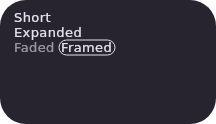
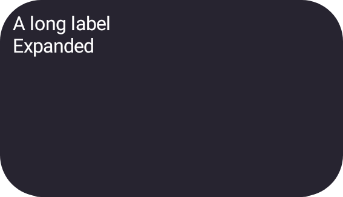
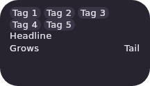

# Remote M3 UI Builder rendering contract

`remote-m3` deliberately has three rendering surfaces. They share one semantic UI Builder document,
but they do not share a renderer and must not be collapsed into one.

| Surface | Purpose | Implementation | Fidelity |
| --- | --- | --- | --- |
| Visual Editor | Select, insert, move and inspect nodes | Wear Compose Material 3 CMP components used as catalog-declared stand-ins | Approximate |
| Browser Preview | Inspect the Remote Compose result in each selected widget host | CMP/Wasm Remote M3 records a `.rc` document; CMP/Wasm `RcComposePlayer` plays those bytes | Real Remote Compose browser preview |
| Native / Live | Make the release decision | AndroidX Remote M3 records on Android; the Android player renders it | Authoritative |

The Visual Editor is allowed to optimize for authoring. It must preserve authored Remote M3
properties, slots, node ids and state, and its `canvasMapping` may only translate them into the names
the Wear stand-in reads. It must never rewrite the stored document to Wear component ids.

The Browser Preview is not another set of lookalikes. The catalog runtime handles protocol-v2
`DEVICE` surfaces by walking the same semantic document with the CMP Remote creation APIs, recording
real Remote M3 components, decoding the resulting document, and passing it to `RcComposePlayer`.
Glance Wear host chrome remains outside the document, just as it does on Android, and is applied per
small/large widget frame around the player.

The catalog does **not** declare the legacy `browserPreview: remote-compose-document` capability.
That capability asks the host/server to compile an RC document and causes the editor to bypass the
catalog runtime's DEVICE surface. It remains useful to catalogs without an executable runtime, but it
is the wrong ownership boundary here.

## Compatibility and pinning

Writer and player move as an explicit compatibility pair:

- writer: the vendored Remote Compose port identified by `vendor/remote-compose-upstream.json`
  (`4307936-ps17-cmp01` at the time this contract was added);
- player: the `rc-players` release in `gradle/libs.versions.toml` (`1.69.0` at the same point).

Both values are pinned by the renderer's dependency graph and declared by the versioned runtime
contract. `remote-m3` emits `compose-ui-builder-runtime/v2`, which adds `remoteComposeWriter` and
`rcPlayer` to v1's five fields. The renderer ZIP verification checks the exact seven-field set and
both pinned values; neither schema accepts undeclared keys. The runtime is then published under an
immutable, exact runtime id. No part of recovery or preview may resolve `latest`, substitute a
merely compatible system, or follow a different catalog pin.

## Failure rules

- Unknown components and unsupported modifiers fail visibly in Browser Preview; they are not
  silently redrawn by a generic Compose component.
- Browser Preview is evidence that the CMP writer/player pair can represent the document, not a
  replacement for Native / Live.
- Native / Live remains authoritative for rectangular, Samsung squircle and Pixel Watch round hosts.
- A writer/player upgrade is reviewed as a rendering change and ships with the catalog runtime that
  names both exact versions.

This division keeps the editor responsive, makes browser feedback real, and preserves Android as the
final source of truth without introducing a second stored design model.

## Layout vocabulary, and what a Wear widget can carry

The palette offers every core `remote-creation-compose` layout, and every surface draws each one.
A `remote-m3` design is still a Glance Wear widget, though, and `GlanceWearProfiles`
(glance-wear 1.0.0-alpha18) fixes which operations a widget document may contain. A layout outside
that profile is authored, previewed and exported as normal, and it **fails on Native / Live**:
the Android writer throws "Operation … is not supported for this version" while it captures the
document. The failure is meant to be obvious rather than silent, so the palette note says so, and
the generated Kotlin carries a comment above the call naming the missing operation.

| Remote Compose | Builder | In the widget profile | Native / Live |
| --- | --- | --- | --- |
| `RemoteBox`, `RemoteRow`, `RemoteColumn` | `layout/box`, `layout/row`, `layout/column` | yes | renders |
| `RemoteFitBox` | `layout/fit-box` | `LAYOUT_FIT_BOX` | renders |
| `RemoteStateLayout` | "Show by state" on `layout/box` | `LAYOUT_STATE` | renders |
| `Modifier.sharedElement` | `sharedElement` modifier | `ANIMATION_SPEC` | renders |
| `RemoteFlowRow` | `layout/flow-row` | no (`LAYOUT_FLOW` is experimental-only) | fails at capture |
| `RemoteCollapsibleColumn` / `Row` | `layout/collapsible-column` / `-row` | no | fails at capture |
| `collapsiblePriority` | `collapsiblePriority` modifier | no | fails at capture |

"Show by state" needs a build with Remote Compose authoring enabled (`-PuiBuilderRemoteCompose=true`).

`sharedElement` exports as `animationSpec(key, true)`. That overload exists in both the released
alpha19 (the native lane) and the vendored port the Browser Preview records with, and it produces the
same `AnimationSpec` operation as `sharedElement(key)`.

The same Browser Preview drawing the three layouts outside the widget profile (their Native / Live render fails at capture):

